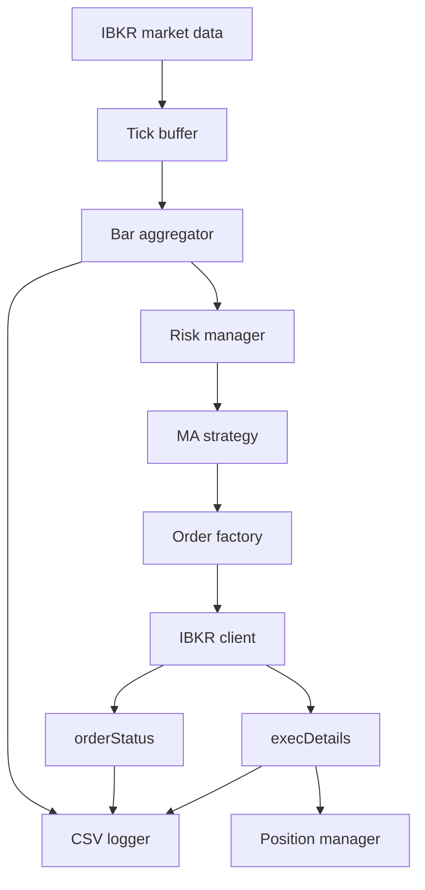

# Architecture

## Runtime Flow

## Module Roles

### `main.py`

Builds the application and keeps the end-to-end flow easy to follow.

### `brokers/ibkr_client.py`

Handles IBKR connection, market data requests, order placement, and callback
events.

### `data/bar_aggregator.py`

Turns live ticks into 1-minute OHLC bars.

### `strategies/ma_crossover.py`

Calculates MA crossover signals and optional entry filters.

### `risk/risk_manager.py`

Applies stop loss, take profit, and daily loss rules before new entries.

### `execution/position_manager.py`

Updates position state from actual fills, not from order submission.

## Design Principles

- keep classes focused
- avoid unnecessary abstraction
- use dataclasses for explicit state
- keep strategy code separate from broker code
- make new strategies easy to add later
