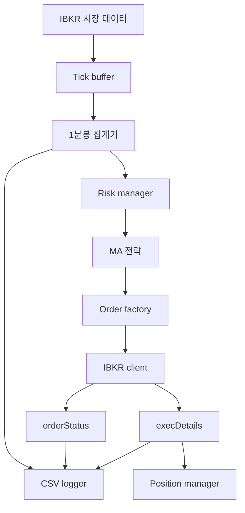

# 아키텍처

## 런타임 흐름

## 모듈별 역할

### `main.py`

애플리케이션 전체를 조립하는 엔트리포인트입니다.

- 설정 로드
- 객체 생성
- 브로커 연결
- 전략 / 리스크 / 실행 흐름 연결

### `brokers/ibkr_client.py`

IBKR 관련 세부 구현을 담당합니다.

- 연결 / 해제
- 시장 데이터 요청
- 주문 전송
- callback 처리
- pending order 상태 관리

### `data/bar_aggregator.py`

실시간 tick을 1분봉 OHLC로 묶습니다.

- 첫 tick: open
- 최고가: high
- 최저가: low
- 마지막 tick: close

### `strategies/ma_crossover.py`

전략 신호를 계산합니다.

- 단기 MA / 장기 MA 계산
- RSI 필터 적용
- MA 간격 필터 적용
- `BUY`, `SELL`, `HOLD` 반환

### `risk/risk_manager.py`

전략보다 먼저 리스크를 적용합니다.

- stop loss
- take profit
- max daily loss

### `execution/position_manager.py`

실제 체결을 바탕으로 포지션 상태를 갱신합니다.

- 주문 전송 시 즉시 포지션 변경 금지
- 체결 이후에만 수량과 평균단가 업데이트
- realized PnL 계산

## 설계 원칙

- 클래스 책임을 작게 유지
- 불필요한 추상화는 피함
- dataclass로 상태를 명시적으로 표현
- 전략과 브로커 구현 분리
- 향후 전략 추가가 쉬운 구조 유지
